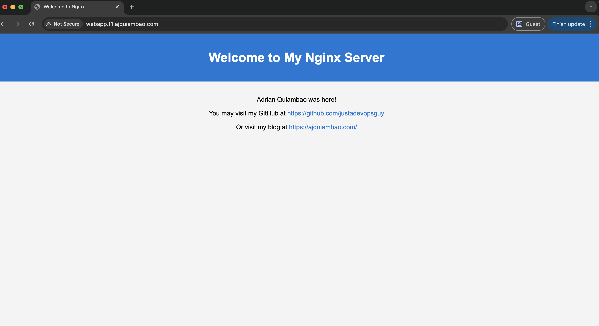

## Important details
* Web URL  > http://webapp.t1.ajquiambao.com/
* IAM User > t1-candidate-1

## Sample Application Preview



The above screenshot shows the custom NGINX application running successfully on the EKS cluster, accessible through the Network Load Balancer.

# AWS EKS Infrastructure with Network Load Balancer

This project sets up a minimal, cost-effective environment on AWS using Elastic Kubernetes Service (EKS). It runs a custom NGINX web app behind a Network Load Balancer, with everything deployed inside a secure, scalable VPC.

## Architecture Overview

The setup looks like this:

Internet
→ Network Load Balancer (in public subnets)
→ EKS Cluster (in private subnets)
→ NGINX Pod (in namespace: t1-ajq)

## AWS Infrastructure Components

### VPC (Virtual Private Cloud)

Everything runs inside an isolated VPC for security and flexibility. Multiple availability zones were created to ensure high availability and resilience.

* Public and private subnets are split across zones
* Public subnets connect to the internet through an Internet Gateway
* Private subnets use a NAT Gateway to reach the internet if needed

### EKS Cluster

The EKS cluster runs inside private subnets and uses AWS’s managed Kubernetes control plane.

* Worker nodes stay in private subnets to reduce exposure
* IAM Roles for Service Accounts (IRSA) handle permissions (enabled but not used)
* The VPC CNI plugin takes care of pod networking

### Route53

To easily understand or remember the webapp. I decided to create a Route53 entry

* Created a public hostedzone  t1.ajquiambao.com, this was made possible using DNS delegation connecting the test AWS account to my main AWS account 

### Worker Nodes

These are EC2 instances managed by EKS.

* They run your Kubernetes workloads in private subnets
* There’s no direct internet access; all outbound traffic goes through the NAT Gateway

### Network Load Balancer (NLB)

We use a Network Load Balancer in public subnets to expose the app.

* Targets individual pod IPs directly
* Operates at Layer 4 for speed and low latency
* Performs health checks on port 80

### Security Groups

Security groups control traffic in and out.

* The EKS cluster security group manages internal cluster communication
* The node group’s security group allows HTTP traffic on port 80, supports NodePorts if needed, and enables node-to-node traffic

## Kubernetes Resources

### Namespace: t1-ajq

This namespace isolates the app within the cluster. Network policies control which pods can talk to each other.

### Network Policy

A policy named `allow-same-namespace` lets pods communicate only within the same namespace, improving security.

### Application Components

#### ConfigMap: nginx-index

Replace the default NGINX welcome page with a custom HTML page served from a mounted ConfigMap. It's mounted directly to `/usr/share/nginx/html/index.html`.

#### Deployment: nginx

Runs a single replica of the `nginx:latest` image on port 80. It mounts the ConfigMap.

#### Service: nginx-lb

Exposes the app externally.

* Service type is LoadBalancer
* Uses annotations to request an NLB
* Includes health check configuration

## Network Flow

### Inbound Traffic

Traffic flows from the internet through the Internet Gateway to the NLB, which then routes requests directly to pod IPs running in private subnets. The pod serves content from the ConfigMap.

### Outbound Traffic

If needed, pods use the NAT Gateway to reach the internet. That traffic exits through the Internet Gateway from the public subnet.

## Security Architecture

### Network Security

* The VPC keeps resources isolated
* Public and private subnets stay separate
* Security groups and Kubernetes network policies add layered traffic control

### Access Control

* IAM handles cluster and node permissions
* Kubernetes uses RBAC for internal control

## Deployment Files

* `t1.yaml`: Create the namespace and network policy for pod to pod communication
* `nginx.yaml`: Deploys the web application, including the ConfigMap, Deployment, and Service

### Load Balancer Annotations

```yaml
service.beta.kubernetes.io/aws-load-balancer-type: "nlb"
service.beta.kubernetes.io/aws-load-balancer-healthcheck-path: "/"
service.beta.kubernetes.io/aws-load-balancer-healthcheck-protocol: "HTTP"
service.beta.kubernetes.io/aws-load-balancer-healthcheck-port: "80"
```

### Health Check Configuration

* Interval: 30 seconds
* Timeout: 5 seconds
* Healthy threshold: 2
* Unhealthy threshold: 2

## Why This Architecture Works

### High Availability

* Subnets span multiple availability zones
* Load balancer distributes traffic automatically
* EKS handles the control plane

### Security

* Workloads stay in private subnets
* Network policies block unwanted traffic
* Security groups provide detailed traffic control

### Performance

* The NLB offers fast, low-latency networking
* Health checks keep things responsive

### Scalability

* EKS integrates with cluster autoscaler (not enabled as add-ons)
* Load balancer adapts as traffic grows

## Monitoring and Troubleshooting

### Common Issues

* Unhealthy targets often mean a security group or network policy is blocking traffic
* If connections time out, check subnet routing and NLB configuration
* Pod connection issues? Double-check VPC CNI and subnet settings

## Before You Deploy

Make sure you’ve set up:

* AWS CLI with the right permissions
* `kubectl` configured to connect to your EKS cluster
* A VPC with public and private subnets and correct routing
* An EKS cluster with worker nodes in private subnets

## Deployment Steps

```bash
# Set up namespace and network policy
kubectl apply -f t1.yaml

# Deploy NGINX
kubectl apply -f nginx.yaml

# Check that everything’s running
kubectl get all -n t1-ajq
kubectl get svc nginx-lb -n t1-ajq

# Retrieve the Load Balancer DNS
kubectl get svc nginx-lb -n t1-ajq -o jsonpath='{.status.loadBalancer.ingress[0].hostname}'
```